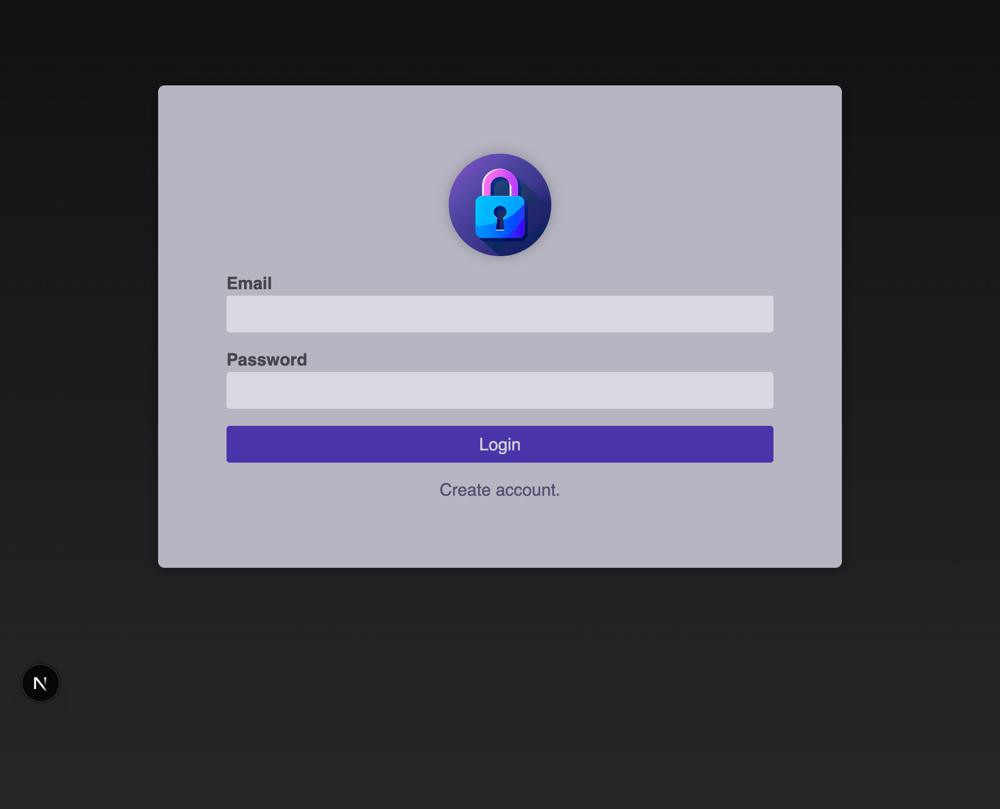

# Authorization

This project is part of the course [Next.js 15 & React - The Complete Guide](https://www.udemy.com/course/nextjs-react-the-complete-guide) by [Maximilian Schwarzmüller](https://github.com/mschwarzmueller). In this fifth project, we explore authentication and authorization mechanisms in Next.js and React.

This project is part of the [Next.js 15 & React - The Complete Guide](https://www.udemy.com/course/nextjs-react-the-complete-guide) by [Maximilian Schwarzmüller](https://github.com/mschwarzmueller). As the fifth project in the course, it focuses on implementing authentication in Next.js and React. Throughout this project, we explore secure authentication flows and user session management to build a robust and secure web application.

## Next Js

This is a [Next.js](https://nextjs.org) project bootstrapped with [`create-next-app`](https://nextjs.org/docs/app/api-reference/cli/create-next-app).

## Getting Started

First, run the development server:

```bash
npm run dev
# or
yarn dev
# or
pnpm dev
# or
bun dev
```

Open [http://localhost:3000](http://localhost:3000) with your browser to see the result.

## Application




## Resources

- [nextjs-complete-guide-course-resources](https://github.com/mschwarzmueller/nextjs-complete-guide-course-resources)
