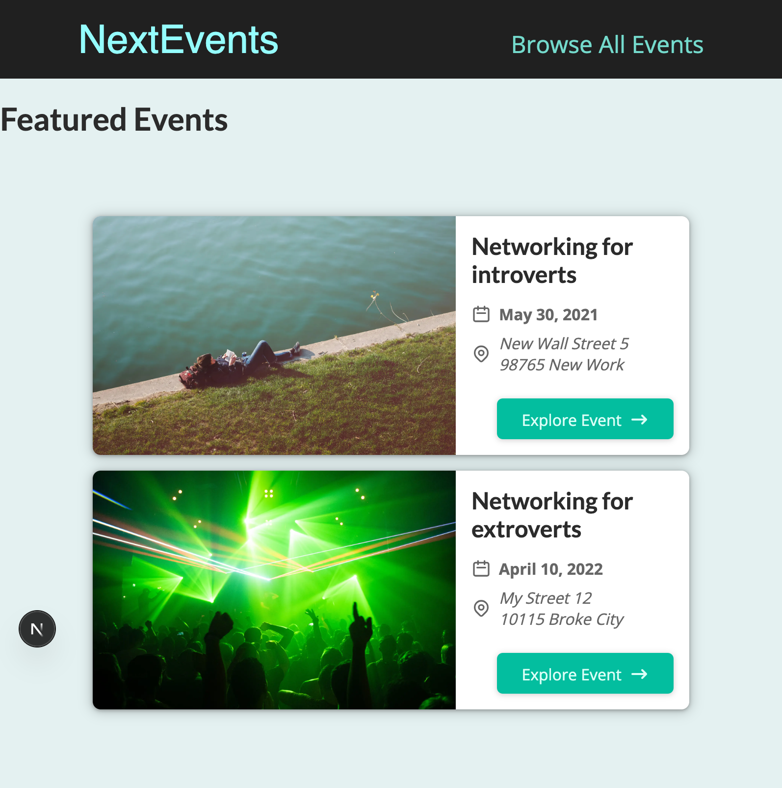
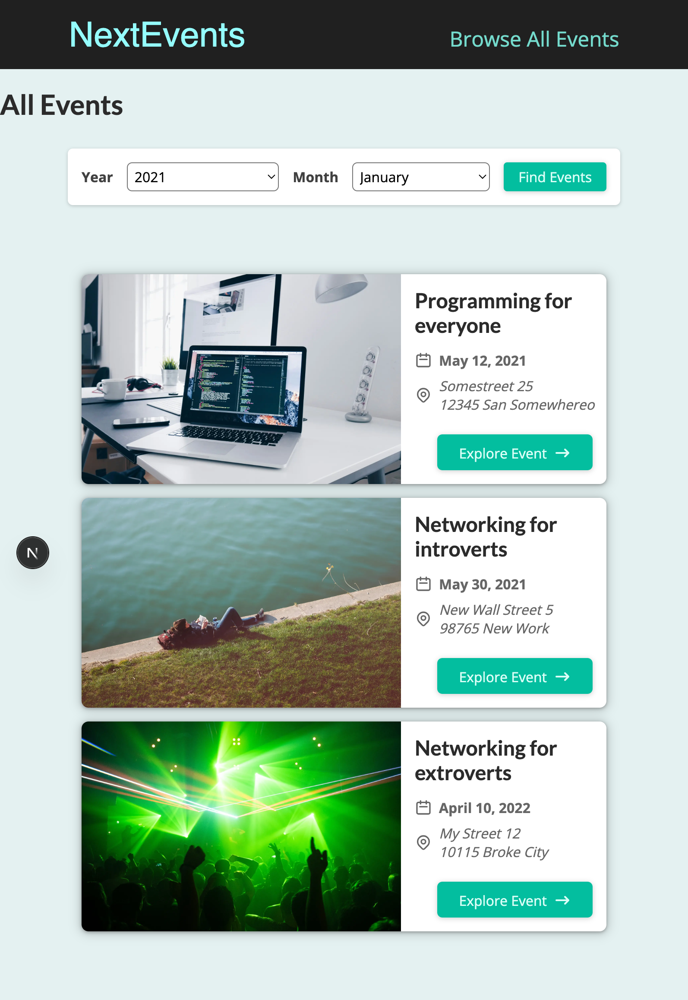
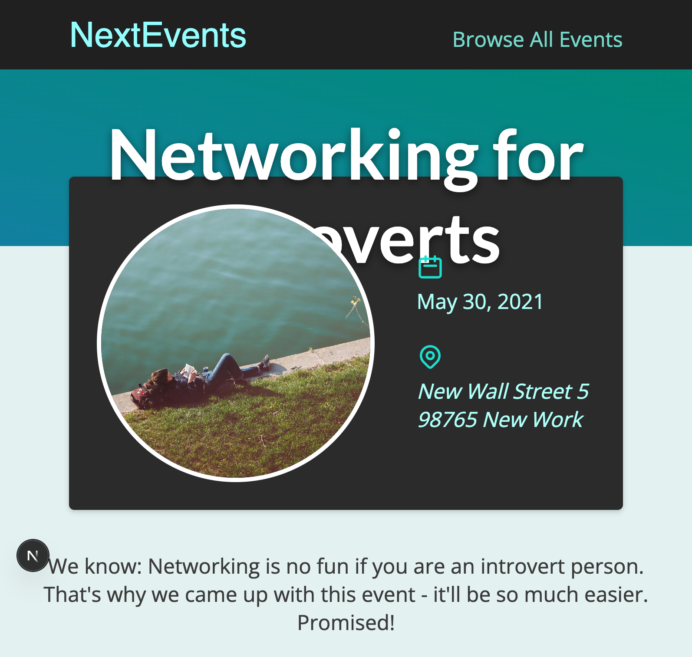
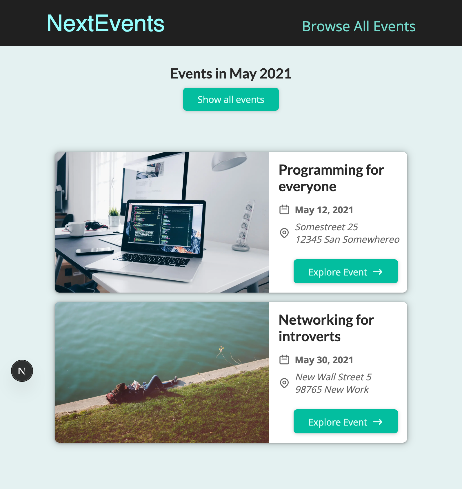

# Next Events

This is the seven project from the course [Next.js 15 & React - The Complete Guide](https://www.udemy.com/course/nextjs-react-the-complete-guide) by [Maximilian Schwarzmüller](https://github.com/mschwarzmueller). In this project, we explore the traditional Pages Router approach in Next.js to build a dynamic Events application. The app will allow users to browse, filter, and view details of various events, demonstrating key concepts such as server-side rendering (SSR), static site generation (SSG), and dynamic routing in older versions of Next.js.

## TODO

List of exercices for this tutorial:

- [x] Create the following routes
  - [x] Home page - Feature events
  - [x] Events page - All events available
    - [x] Events Details page
    - [x] Filtered Events page
- [ ] Create the following API routes
  - [x] Signup to a newsletter
  - [ ] Add comments to an event
  - [ ] Get all the comments belonging to a event

## Next Js

This is a [Next.js](https://nextjs.org) project bootstrapped with [`create-next-app`](https://nextjs.org/docs/app/api-reference/cli/create-next-app).

## Getting Started

First, run the development server:

```bash
npm run dev
# or
yarn dev
# or
pnpm dev
# or
bun dev
```

Open [http://localhost:3000](http://localhost:3000) with your browser to see the result.

## Application







## Resources

- [nextjs-complete-guide-course-resources](https://github.com/mschwarzmueller/nextjs-complete-guide-course-resources)
