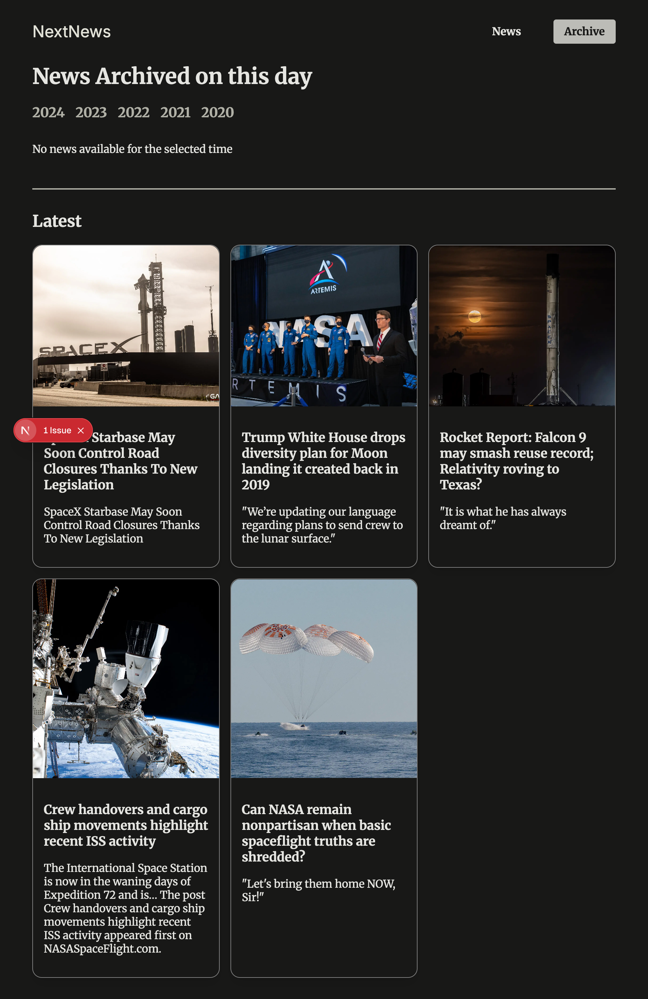

# Routing & Rendering: Deep Dive

This is the second project from the course [Next.js 15 & React - The Complete Guide](https://www.udemy.com/course/nextjs-react-the-complete-guide) by [Maximilian Schwarzmüller](https://github.com/mschwarzmueller)

## TODO

List of exercices for this tutorial:

- [x] Create the following routes
   - [x] News page
      - [x] News Details
- [X] Create a main header with the following links
   - [X] Home page
   - [X] News page

## Next Js

This is a [Next.js](https://nextjs.org) project bootstrapped with [`create-next-app`](https://nextjs.org/docs/app/api-reference/cli/create-next-app).

## Getting Started

First, run the development server:

```bash
npm run dev
# or
yarn dev
# or
pnpm dev
# or
bun dev
```

Open [http://localhost:3000](http://localhost:3000) with your browser to see the result.

## Application





## Resources

- [nextjs-complete-guide-course-resources](https://github.com/mschwarzmueller/nextjs-complete-guide-course-resources)
